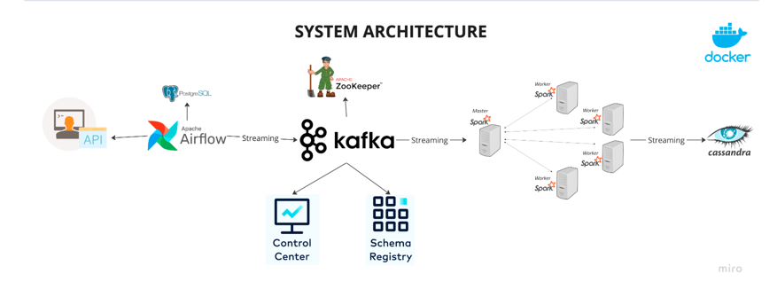

# Real-Time Data Pipeline: Airflow + Kafka + Spark + Cassandra


## Project Description
This project implements a real-time data pipeline that fetches user data from an external API, streams it via Kafka, processes it using Spark Structured Streaming, and stores the result in a Cassandra database. Docker is used to containerize all components to ensure reproducibility, scalability, and ease of deployment.

## Technologies Used
- Apache Airflow: Workflow orchestration
- Apache Kafka: Real-time message broker
- Apache Spark (PySpark): Stream processing
- Apache Cassandra: NoSQL data storage
- Docker & Docker Compose: Service containerization

## Architecture Overview
1. **Airflow DAG** triggers a Python function daily to fetch user data from a public API.
2. The function formats and publishes the data to a Kafka topic (`users_created`).
3. A Spark Structured Streaming application reads data from Kafka, parses it, and writes it to Cassandra.
4. The Cassandra database serves as the storage layer for all processed records.

### Data Flow Diagram
```
Random User API
       |
       v
Airflow DAG (stream_data task)
       |
       v
Kafka Topic: users_created
       |
       v
Spark Structured Streaming Job
       |
       v
Cassandra Table: spark_streams.created_users
```

---

## Initial Environment Setup

### Docker Setup
1. **Start Docker Daemon** if it's not already running.
2. **Build and Run Services**:
   ```bash
   docker compose up -d
   ```
   This launches the following services:
    - Kafka Broker
    - Zookeeper
    - Airflow Scheduler & Webserver
    - Spark Master and Worker
    - Cassandra
    - (Optional) Control Center for Kafka UI

### Memory Optimization (Optional)
To reduce memory consumption:
```bash
docker stop control-center
docker stop schema-registry
```

---

## Application Components

### 1. Airflow DAG (kafka_stream.py)
- DAG Name: `user_automation`
- Task: `stream_data_from_api`
- Fetches random user data from `https://randomuser.me/api/`
- Converts the data into a structured format
- Streams the formatted JSON data to Kafka topic `users_created`
- Runs for 60 seconds per trigger

### 2. Kafka (Message Broker)
- Kafka topic used: `users_created`
- Stores the raw user data streamed from Airflow
- Acts as the buffer between producer (Airflow) and consumer (Spark)

### 3. Spark Streaming Application (spark_stream.py)
- Connects to Kafka topic `users_created`
- Defines a schema to parse JSON payloads
- Connects to Cassandra
- Ensures the Cassandra keyspace (`spark_streams`) and table (`created_users`) exist
- Writes parsed data to Cassandra using structured streaming

### 4. Cassandra (NoSQL Storage)
- Keyspace: `spark_streams`
- Table: `created_users`
- Schema includes fields such as:
    - id (UUID, Primary Key)
    - first_name, last_name, gender, email
    - address, postcode, username, dob, registered_date, phone, picture

---

## Execution Instructions

### Step 1: Launch Docker Environment
```bash
docker compose up -d
```

### Step 2: Trigger Airflow DAG
1. Navigate to Airflow UI at `http://localhost:8080`
2. Locate the DAG named `user_automation`
3. Toggle it ON
4. Manually trigger the DAG via the UI

### Step 3: Run Spark Streaming Script
```bash
pip install -r requirements.txt  # Optional for local Python runs
python3 spark_stream.py
```
This will:
- Stream data from Kafka
- Parse the data into structured format
- Store the data in Cassandra

### Step 4: Verify Data in Cassandra
```bash
docker exec -it cassandra cqlsh
USE spark_streams;
SELECT * FROM created_users;
```

---

## Common Issues & Troubleshooting

### Port Already in Use
```bash
lsof -i :<port>
kill -9 <PID>
```

### Kafka Topic Not Found
```bash
docker exec broker kafka-topics --list --bootstrap-server localhost:29092
```
Create topic manually:
```bash
docker exec broker kafka-topics --create --topic users_created \
--bootstrap-server localhost:29092 --partitions 1 --replication-factor 1
```

### Cassandra Connection Errors
- Ensure the container is fully initialized
- Restart if needed:
  ```bash
  docker restart cassandra
  ```

---

## Container Overview

| Container         | Description                        |
|------------------|------------------------------------|
| `broker`         | Kafka Broker for streaming         |
| `zookeeper`      | Coordinates Kafka services         |
| `cassandra`      | NoSQL database                     |
| `webserver-1`    | Airflow Web UI                     |
| `scheduler-1`    | Executes Airflow DAGs              |
| `spark-master-1` | Spark Master (job dispatcher)      |
| `spark-worker-1` | Spark Worker (task executor)       |
| `control-center` | Kafka monitoring UI (optional)     |

---

## Summary
This pipeline provides a real-time, end-to-end solution for ingesting, processing, and storing structured user data. It demonstrates the integration of major data engineering tools and supports scalability, fault tolerance, and modularity through containerization.

This setup is suitable for building real-time analytics, streaming dashboards, or ETL workflows that require low-latency data processing.

Next steps could include deploying this setup to a cloud platform, adding monitoring and alerting, or integrating with BI tools such as Apache Superset or Grafana.

